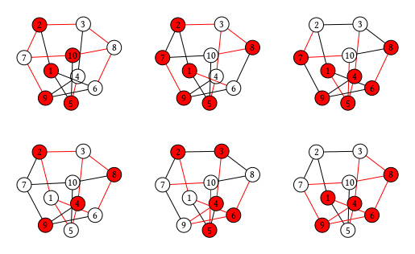

# LuxorGraphPlot

A minimum package for displaying a graph and configurations defined on graphs.
It is the [`Luxor`](https://github.com/JuliaGraphics/Luxor.jl) version of [`GraphPlot`](https://github.com/JuliaGraphs/GraphPlot.jl).

Install by typing `using Pkg; Pkg.add("LuxorGraphPlot")` in a julia REPL.

## Example
Please check [this notebook](https://giggleliu.github.io/LuxorGraphPlot.jl/notebooks/tutorial.html).

In a notebook or IDE with graphical display, use the following statements to show your graph.

```julia
julia> using LuxorGraphPlot, Graphs

julia> show_graph(smallgraph(:petersen); format=:svg)
```


Use the following statement to show a gallery

```julia
julia> show_gallery(smallgraph(:petersen), (2, 3); format=:png,
        vertex_configs=[rand(Bool, 10) for k=1:6],
        edge_configs=[rand(Bool, 15) for k=1:6], pad=0.5)
```
