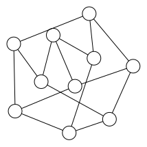
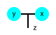

# LuxorGraphPlot

A minimum package for displaying a graph and configurations defined on graphs.
It is the [`Luxor`](https://github.com/JuliaGraphics/Luxor.jl) version of [`GraphPlot`](https://github.com/JuliaGraphs/GraphPlot.jl).

Install by typing `using Pkg; Pkg.add("LuxorGraphPlot")` in a julia REPL.

(NOTE: After implementing this package, I noticed there is a similar package with more features: https://github.com/cormullion/Karnak.jl.)

## Example

In a notebook or IDE with graphical display, use the following statements to show your graph.

```julia
julia> using LuxorGraphPlot, Graphs

julia> show_graph(smallgraph(:petersen); format=:svg)
```


### Lower-level API

You can also use the lower-level API to customize the graph display.

```julia
using LuxorGraphPlot, LuxorGraphPlot.Luxor

drawing = nodestore() do ns
    c1 = circle!((-20.0, 0.0), 10)
    c2 = circle!((20.0, 0.0), 10)
    c3 = dot!((0.0, 20.0))
    with_nodes() do
        sethue("cyan")
        fill(c1)
        fill(c2)
        sethue("black")
        text("y", c1)
        text("x", c2)
        text("z", offset(c3, (10, 0)))
        line(c1, c2)
        line(midpoint(c1, c2), c3)
        end
    end
```

The output is as follows:

